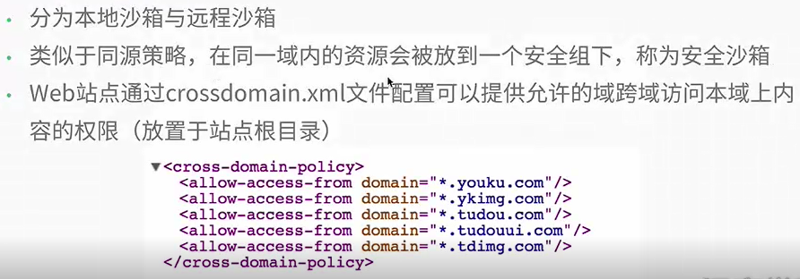
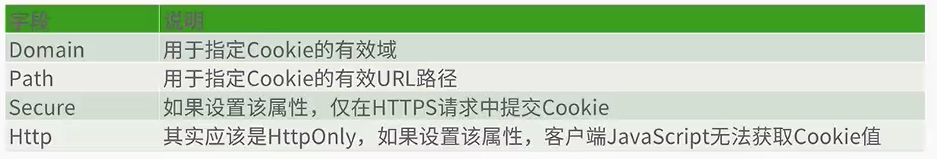
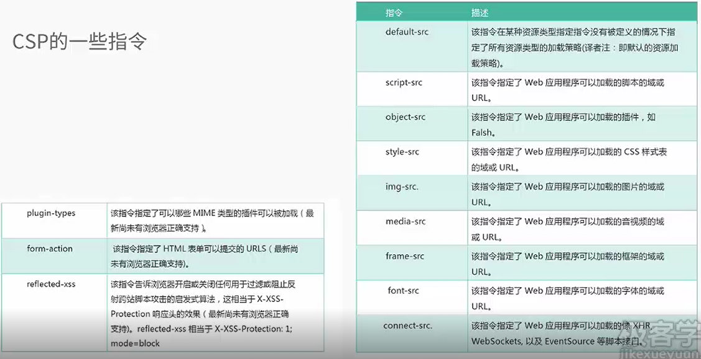

1、浏览器同源策略
2、沙盒框架(Sandboxed frame)


```html
<iframe src="www.baidu.com" sandbox="allow-scripts allow-forms"></iframe>
```

3、Flash安全沙箱()



4、Cookie的安全策略

5、内容安全策略(Content Security Policy，CSP)

通过编码在HTTP响应头中的指令来实施策略

如`Content-Security-Policy:script-src 'self' https://www.test.com`



6、cookies与session

7、浏览器渲染机制